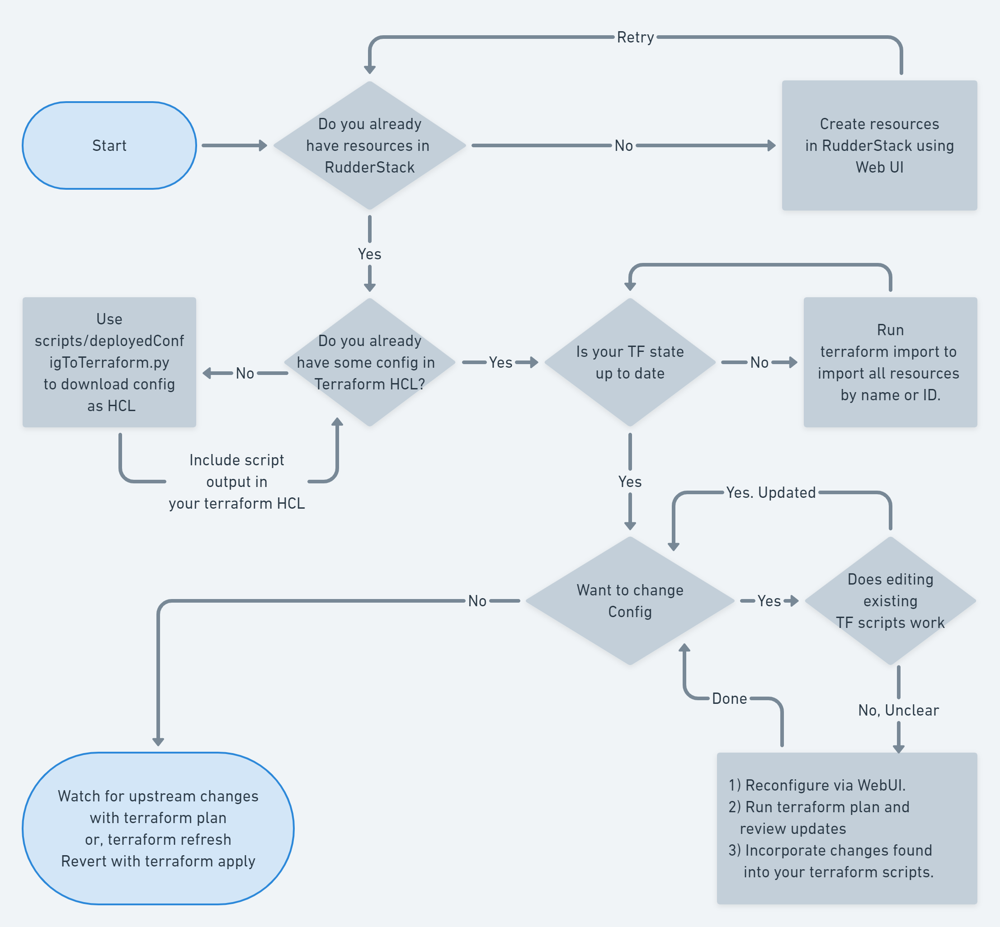

<p align="center"><a href="https://rudderstack.com"></a></p>
<h1 align="center"></h1>
<p align="center"><b>Customer Platform for Developers</b></p>
<br/>


# Terraform Provider RudderStack 

# Description

This repo implements RudderStack terraform provider. Use it to access RudderStack control plane API from within Terraform.  

Questions? Please join our [Slack channel](https://resources.rudderstack.com/join-rudderstack-slack) or read about us on [Product Hunt](https://www.producthunt.com/posts/rudderstack).

# Getting Started
1. If you are not familiar with Terraform platform, then a good place to start is [here](https://www.terraform.io/intro/index.html).
2. If you are interested in developing enhancements to RudderStack's Terraform provider, the best place to start is by creating a local build and test environment using an example configuration [here](#example).
3. If you are a user interested in managing your production RudderStack resources via Terraform, you can get detailed documentation for our Terraform Provider [here](docs/index.md). 

## Terraform Scripting Flowchart for RudderStack
To create and maintain RudderStack's resources in Terraform, you can follow the flowchart below. 


<a id="example"></a>
# Setup dev and build env 

## PreRequisites 
Make sure that following are installed.
1. bash (On Windows, consider using WSL2 Ubuntu) 
2. go
3. make

## Build provider

Run the following command to build and install the provider

```shell
$ make
$ make install
```

Next, make sure that your ~/.terraformrc has the following lines. 
```
provider_installation {
  dev_overrides {
    "rudderlabs/rudderstack" = "~/.terraform.d/plugins/rudderstack.com/rudderlabs/rudderstack/0.2.12/linux_amd64/"
  }
}
```
The above ensures that that locally built terraform provider binary is used instead of the one available at registry.terraform.io

## Test sample configuration
Navigate to the `examples` directory. 

```shell
$ cd examples
```

Run the following command to initialize the workspace and apply the sample configuration.

```shell
$ terraform init && terraform apply
```
## Make new release
### Create a new tag with properly named version number.
``` shell
git tag vX.Y.Z
git push
```

### Create new release.

``` shell
goreleaser release --rm-dist
``` 

# Related 
   1) https://github.com/rudderlabs/cp-client-go : This repo implements REST API client for RudderStack Control Plain in Golang.
   1) https://github.com/rudderlabs/rscp_pyclient : This repo implements REST API client for RudderStack Control Plain in Python. Few additional RudderStack related helpful methods also available.
   1) https://github.com/rudderlabs/segment-migrator : Source code for segment migrator web app. Helps migrate from
      Segment to RudderStack.
   1) http://segment-migrator.dev-rudder.rudderlabs.com/ : If you are trying to migrate from Segment to RudderStack, you can use this web app to migrate. 

# License

RudderStack Terraform Provider is released under the [MIT License][mit_license].

# Contribute

We would love to see you contribute to RudderStack. Get more information on how to contribute [here](CONTRIBUTING.md).

# Follow Us

- [RudderStack Blog][rudderstack-blog]
- [Slack][slack]
- [Twitter][twitter]
- [LinkedIn][linkedin]
- [dev.to][devto]
- [Medium][medium]
- [YouTube][youtube]
- [HackerNews][hackernews]
- [Product Hunt][producthunt]

<!----variables---->

[slack]: https://resources.rudderstack.com/join-rudderstack-slack
[twitter]: https://twitter.com/rudderstack
[linkedin]: https://www.linkedin.com/company/rudderlabs/
[devto]: https://dev.to/rudderstack
[medium]: https://rudderstack.medium.com/
[youtube]: https://www.youtube.com/channel/UCgV-B77bV_-LOmKYHw8jvBw
[rudderstack-blog]: https://rudderstack.com/blog/
[hackernews]: https://news.ycombinator.com/item?id=21081756
[producthunt]: https://www.producthunt.com/posts/rudderstack
[mit_license]: https://opensource.org/licenses/MIT
[agplv3_license]: https://www.gnu.org/licenses/agpl-3.0-standalone.html
[sspl_license]: https://www.mongodb.com/licensing/server-side-public-license
[config-generator]: https://github.com/rudderlabs/config-generator
[config-generator-section]: https://github.com/rudderlabs/rudder-server/blob/master/README.md#rudderstack-config-generator
[rudder-logo]: https://repository-images.githubusercontent.com/197743848/b352c900-dbc8-11e9-9d45-4deb9274101f

