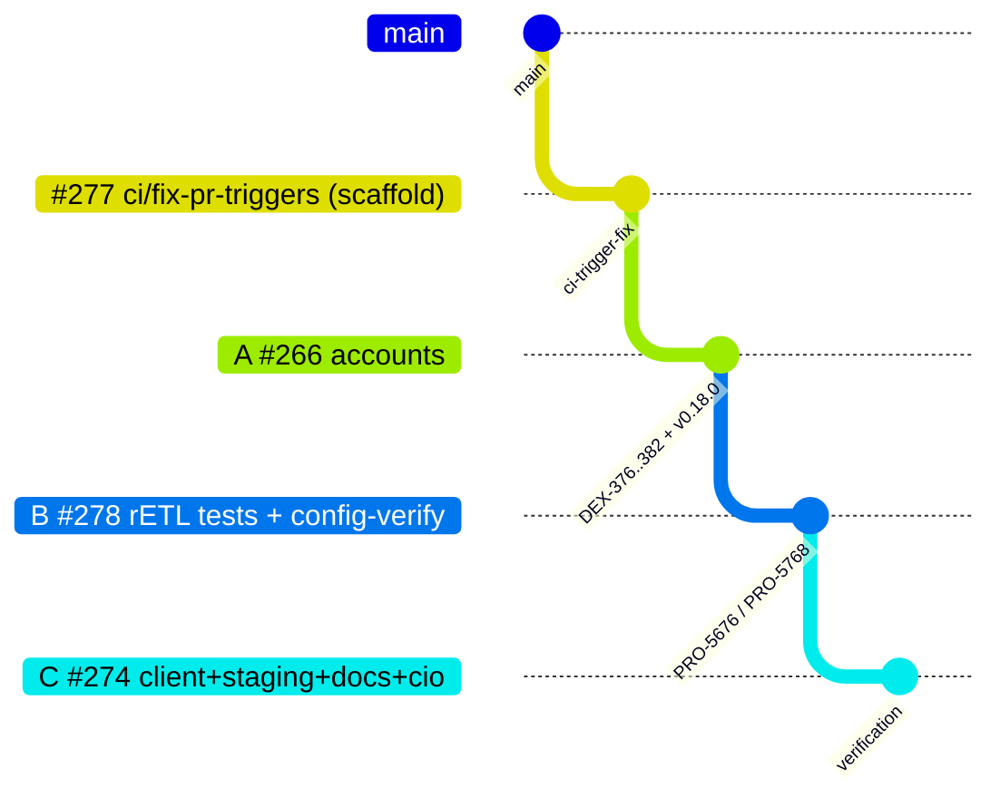
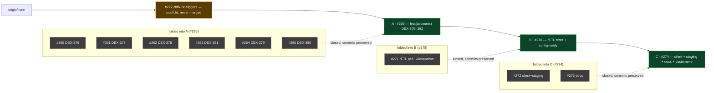

# Branch / PR Map — TF rETL Account Management verification

Layout for the
[TF — rETL Account Management (Lovable Phase 1)](https://linear.app/rudderstack/project/tf-retl-account-management-lovable-phase-1-6076c97fd07f)
project. The original **13 stacked PRs** have been **collapsed into 3 review units
(A / B / C)** stacked on the **#277 CI scaffold**. Render with any Mermaid-aware
viewer (GitHub, Notion, VS Code, mermaid.live).

## Current state — 3 review PRs on the #277 scaffold

Linear chain: `main → #277 → A (#266) → B (#278) → C (#274)`. Reviewers see **3
PRs**; #277 is a never-merged base that lets every PR run checks pre-merge.

## How the 13 PRs collapsed

🟩 kept (review unit) · 🟧 scaffold (never merged) · ⬛ closed (folded in)

## Consolidation map

| Review PR | Branch | Base | Folds in (closed) | Contents |
|-----------|--------|------|-------------------|----------|
| **#277** scaffold | `ci/fix-pr-triggers` | `main` | — | Run e2e + unit on all PRs (drop `branches:[main]`) — PRO-5776. **Never merged**; closed at the end. |
| **A · #266** | `feature/dex-382-…` | #277 | #260, #261, #262, #263, #264, #265 | Full accounts feature (DEX-376–382): registry, generic `resource_account` CRUD, data source, `AssertAccount` helper, BigQuery `ConfigMeta`, provider + `NewAPIClient` wiring, BigQuery integration test. rudder-iac **v0.18.0**, `client.*` consumer migration, `e2e-account-crud` job. |
| **B · #278** | `feature/pro-5768-…` | A (#266) | #271 | rETL source/connection acceptance tests on BigQuery (Alexandros's commits preserved) + PRO-5768 upstream config verification. |
| **C · #274** | `feature/retl-customerio-audience-acc` | B (#278) | #272, #273 | Real Accounts client + 404 fix, `test/e2e/staging` smoke (`run.sh` + PAUSE hold-open + label-gated `e2e-staging-smoke.yml`), HANDOFF/BRANCH-MAP docs, `customerio_audience` coverage. |

Closed PRs carry a comment pointing to their keeper; their commits live on in the
kept branch (nothing abandoned). They can be reopened if a split is ever needed.

## Merge plan (never merging #277)

Review A → B → C. Then collapse upward — merge **C into B**, **B into A** (one
final check run on the combined A) — then **rebase A off #277 onto `main`** (drops
the single scaffold commit; restores `branches:[main]`), and merge A into `main`.
Close #277. The CI-trigger change never lands in `main`.

## Notes

- **#237** could not be reopened (force-pushed after close); its commits live in **B** (#278) via #271, authorship intact.
- **Secrets, not Vault.** A Vault integration was prototyped and removed — the e2e tests source creds from GitHub Environment secrets/vars on the `e2e` environment (`RUDDERSTACK_ACC_TEST_TOKEN`, `RUDDERSTACK_STAGING_*`, and `RUDDERSTACK_RETL_TEST_ACCOUNT_ID` once the dev seed account is aligned).
- **Staging smoke** runs pre-merge via the `e2e-staging` label on #274 (and `workflow_dispatch` once on `main`); it applies → asserts no drift → destroys against staging.
- **rudder-iac v0.18.0** is standardized across the chain (the old `#617` pseudo-version gate is gone).
- `verify/accounts-retl-e2e` (the old local integrated reference) has been **deleted** — the C tip / `integration/retl-accounts-full` is the current full integration.
