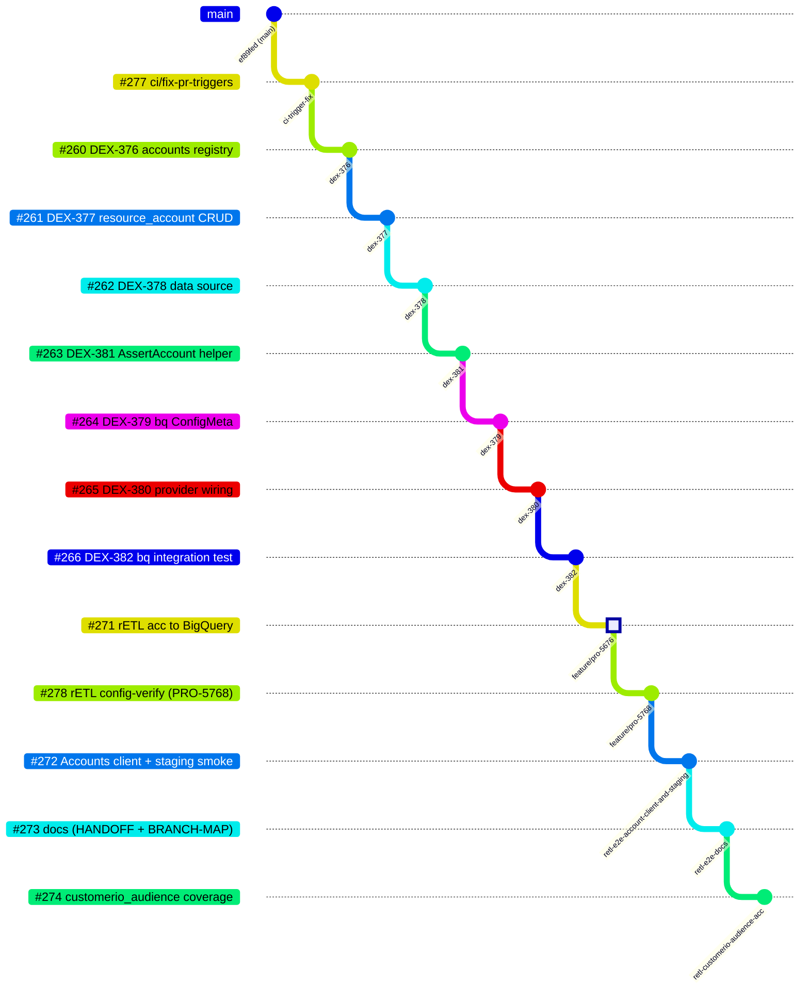
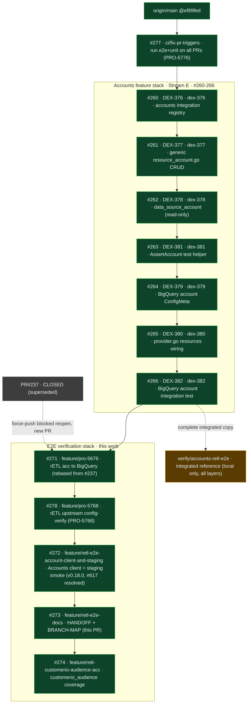

# Branch / PR Map — TF rETL Account Management verification

Full branch & PR layout for the
[TF — rETL Account Management (Lovable Phase 1)](https://linear.app/rudderstack/project/tf-retl-account-management-lovable-phase-1-6076c97fd07f)
project: the 7-PR **accounts feature stack** (Stream E) plus the **e2e verification stack** built on top of it — the whole chain now rooted on the CI-enablement PR **#277**.
Render with any Mermaid-aware viewer (GitHub, Notion, VS Code, mermaid.live).

## Git tree

*Branch lanes are labelled by PR (`#NNN` + DEX issue); commit dots carry the branch name. HIGHLIGHT (#271) = the lane carrying Alexandros Milaios's preserved commits. Lower 7 lanes = accounts feature stack (Stream E); upper 4 = this verification stack.*

## PR stack (bottom-up merge order)

🟩 remote/pushed · 🟧 local-only · ⬛ closed

## Accounts feature stack (Stream E)

| PR | Issue | Branch (`feature/…`) | Base | Summary |
|----|-------|----------------------|------|---------|
| #260 | DEX-376 | `dex-376-…-add-accounts-registry` | `main` | Accounts integration registry |
| #261 | DEX-377 | `dex-377-…-generic-resource_accountgo-crud-handler` | #260 | generic `resource_account.go` CRUD + import |
| #262 | DEX-378 | `dex-378-…-data_source_accountgo-read-only` | #261 | read-only `rudderstack_account` data source |
| #263 | DEX-381 | `dex-381-…-build-assertaccount-test-helper` | #262 | `AssertAccount` / `AccAssertAccount` helpers |
| #264 | DEX-379 | `dex-379-…-bigquery-account-integration-file` | #263 | BigQuery account `ConfigMeta` + example |
| #265 | DEX-380 | `dex-380-…-wire-providergo-resources-datasourcesmap` | #264 | register resource + data source in `provider.go` |
| #266 | DEX-382 | `dex-382-…-bigquery-account-integration-test` | #265 | BigQuery account integration test + docs |

## Linear tree (current — bottom-up merge order)

The whole chain is now stacked on **#277** so every PR's head carries the CI
trigger-fix and runs checks. rudder-iac is standardized to **v0.18.0**
throughout (the #617 gate is dissolved — it's now a tagged release).

| PR | Branch | Base | Contents |
|----|--------|------|----------|
| **#277** | `ci/fix-pr-triggers` | `main` | run e2e + unit on all PRs (drop `branches:[main]`) — PRO-5776 |
| #260–#266 | `feature/dex-376…382` | #277 → … | accounts stack (Stream E); #261 bumps rudder-iac→v0.18.0; #262/#263 carry the `client.*` consumer migration; #266 adds the `e2e-account-crud` job |
| **#271** | `feature/pro-5676…` | #266 | rETL acceptance tests (Alexandros authorship preserved) → BigQuery |
| **#278** | `feature/pro-5768-retl-upstream-config-verify` | #271 | rETL upstream config verification — PRO-5768 |
| **#272** | `feature/retl-e2e-account-client-and-staging` | #278 | real Accounts client wiring + 404 fix + `test/e2e/staging` smoke (v0.18.0; duplicate stub-migration dropped) |
| **#273** | `feature/retl-e2e-docs` | #272 | `HANDOFF.md` + `BRANCH-MAP.md` (this PR) |
| **#274** | `feature/retl-customerio-audience-acc` | #273 | `retl_connection_customerio_audience` coverage |

## Notes

- **#237 could not be reopened** — its branch was force-pushed after close, which GitHub blocks. #271 carries the identical commits (Alexandros's authorship intact) as a new PR.
- **`verify/accounts-retl-e2e`** is kept locally as the complete integrated reference (all layers in one branch); the [HANDOFF](HANDOFF.md) runbook targets the pushed stack tip `feature/retl-customerio-audience-acc`.
- **Merge order:** merge bottom-up starting at **#277** → main; each PR below auto-retargets to `main` as the one beneath it merges, and its checks run green before merge.
- **rudder-iac v0.18.0 / #617:** the released v0.18.0 supersedes the old `#617` pseudo-version pin, so #272 is no longer gated. The stub-removal + `client.*` migration (originally duplicated across #261 and #272) now lands once, in the accounts stack.
