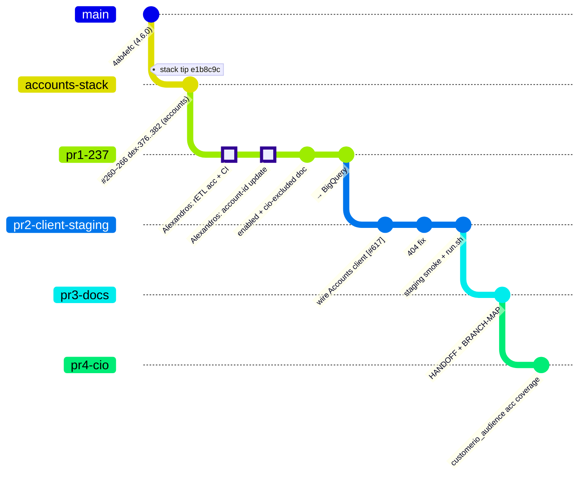
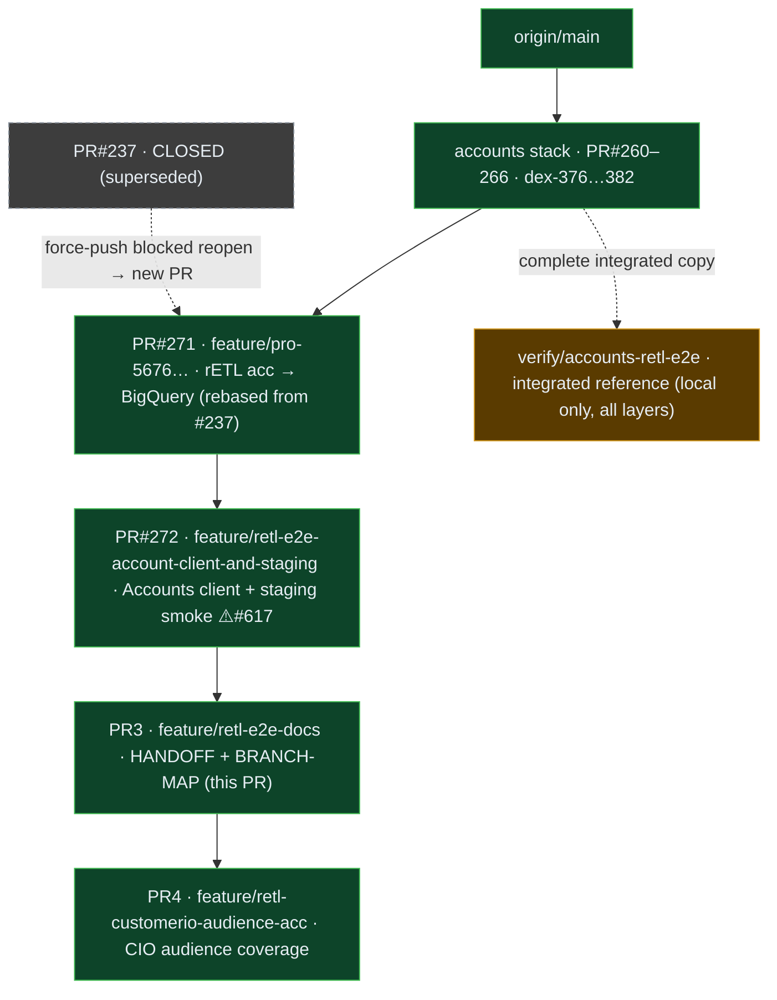

# Branch / PR Map — TF rETL Account Management verification

Branch & PR layout for the
[TF — rETL Account Management (Lovable Phase 1)](https://linear.app/rudderstack/project/tf-retl-account-management-lovable-phase-1-6076c97fd07f)
verification work. Render with any Mermaid-aware viewer (GitHub, Notion, VS Code, mermaid.live).

## Git tree

*HIGHLIGHT = Alexandros Milaios's preserved commits.*

## PR stack (bottom-up merge order)

🟩 remote/pushed · 🟧 local-only · ⬛ closed

| PR | Branch | Base | Contents | Merge gate |
|----|--------|------|----------|-----------|
| **#271** | `feature/pro-5676…terraform` | `feature/dex-382` (#266) | rETL acceptance tests (Alexandros, authorship preserved) → BigQuery; CIO documented-excluded | after accounts stack |
| **#272** | `feature/retl-e2e-account-client-and-staging` | #271 | real Accounts client wiring + 404 fix + `test/e2e/staging` smoke | **rudder-iac #617** |
| **PR3** | `feature/retl-e2e-docs` | #272 | `HANDOFF.md` + `BRANCH-MAP.md` | with #272 |
| **PR4** | `feature/retl-customerio-audience-acc` | PR3 | `retl_connection_customerio_audience` acc coverage (flips gate exclusion→enforced) | with stack |

## Notes

- **#237 could not be reopened** — its branch was force-pushed after close, which GitHub blocks. #271 carries the identical commits (Alexandros's authorship intact) as a new PR.
- **`verify/accounts-retl-e2e`** is kept locally as the complete integrated reference (all four layers in one branch) and as the runnable target for the [HANDOFF](HANDOFF.md) test runbook.
- The accounts stack #260–266 should merge bottom-up into `main` first; then this 4-PR stack rebases onto `main` and #272's `go.mod` pin flips to a released rudder-iac version once #617 lands.
